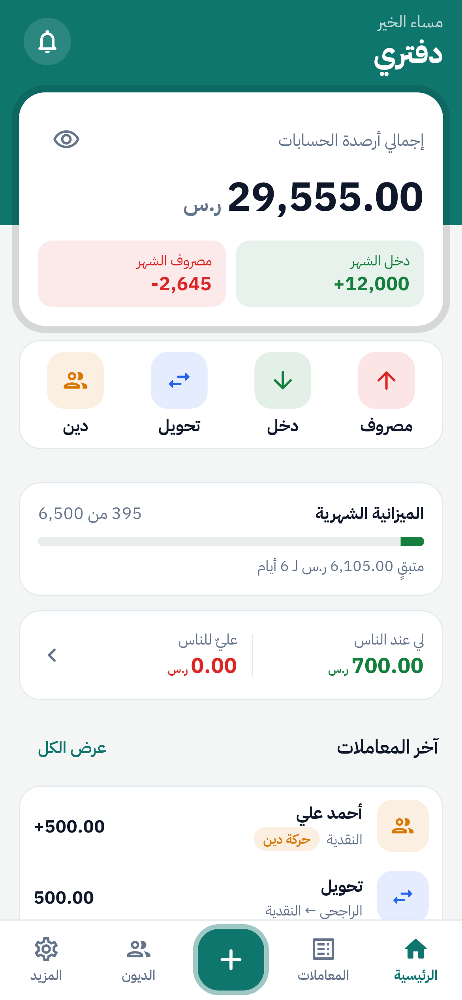
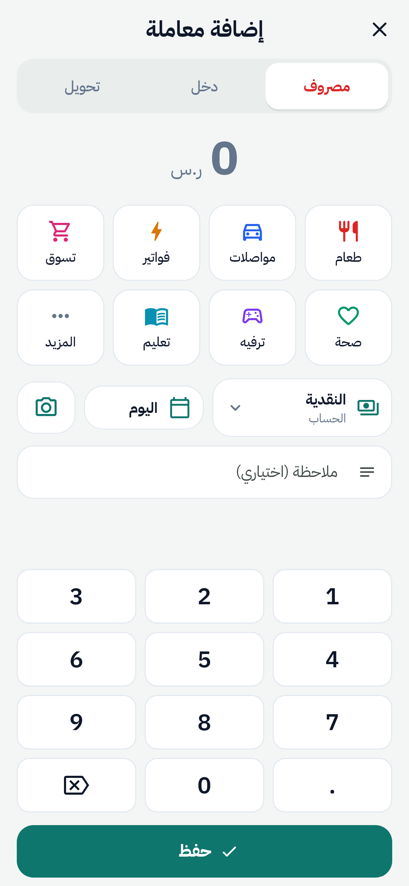
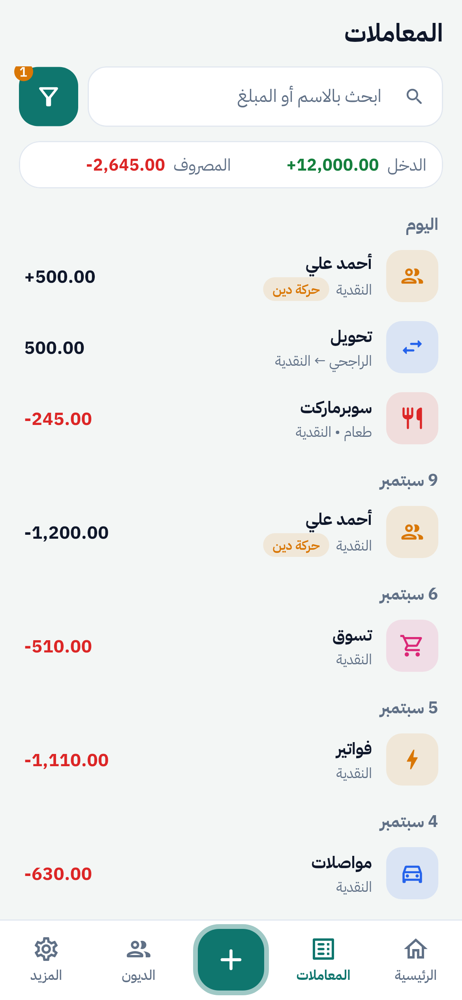
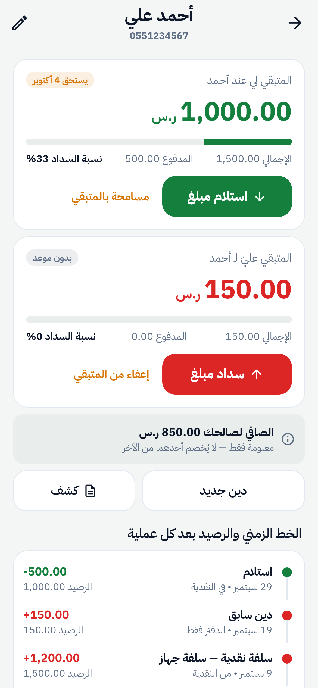
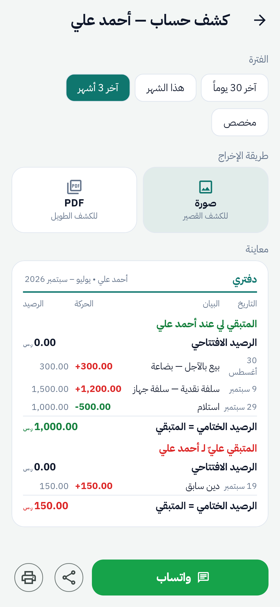
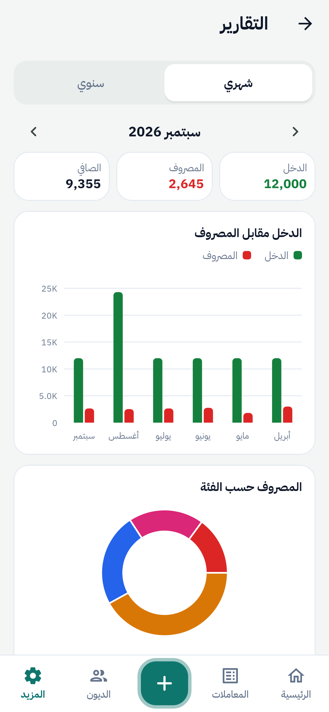
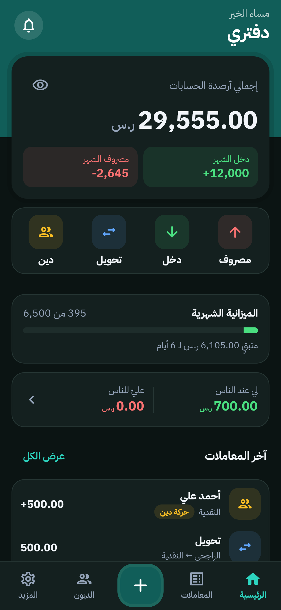
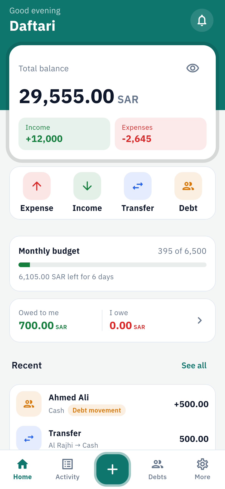

# دفتري — Daftari

دفتر حسابات شخصي وإدارة ديون للأفراد وأصحاب الأعمال الصغيرة.
تطبيق جوال لنظامي **Android و iOS** — يعمل **بدون تسجيل دخول وبدون إنترنت**، والبيانات تبقى على جهاز المستخدم، مع نسخ احتياطي سحابي **اختياري ومشفّر** بحساب المستخدم الشخصي (Google Drive / iCloud).

> بُني وفق وثيقة المشروع «تطبيق دفتري» (الفصول 1–4): المتطلبات الوظيفية FR-01…FR-27، نموذج البيانات ERD، مخططات الفئات، ونظام التصميم والشاشات التسع عشرة.

---

## المزايا

| الوحدة | ما يقدمه التطبيق |
|---|---|
| الإعداد الأول | بدون حساب؛ اختيار عملة واحدة إلزامي مع تأكيد ثم قفلها، وإنشاء حساب «النقدية» والفئات تلقائياً |
| المعاملات | دخل / مصروف / تحويل في أقل من 10 ثوانٍ: لوحة أرقام، فئات كأيقونات، اقتراح الحساب تلقائياً، إيصال مصوَّر |
| السجل | بحث فوري، زر فلترة واحد (الفترة، الحساب، النوع، الفئة، حركات الديون، الترتيب)، تعديل وحذف بالسحب مع «تراجع» 5 ثوانٍ |
| الحسابات | نقدي، بنكي، محفظة، توفير — **لا حذف أبداً** بل أرشفة (محمية بمشغّل في قاعدة البيانات)، تسوية الرصيد، إعادة الاحتساب للتدقيق |
| الديون | «لي / عليّ»، سداد جزئي، حالة آلية (مفتوح/جزئي/مسدَّد)، «حركة دين» تحرّك الرصيد دون أن تُحتسب دخلاً أو مصروفاً، البيع بالآجل في الدفتر فقط |
| الملف المالي | لكل شخص: المتبقي والمدفوع والاستحقاق وخط زمني، و**كشف حساب صورة أو PDF** يُشارك عبر واتساب أو يُطبع |
| الميزانية | سقف شهري لكل فئة مع تنبيه عند 75% و100% وألوان دلالية |
| التقارير | ملخص الفترة، مقارنة 6 أشهر، توزيع حسب الفئات، تصدير PDF و Excel |
| الأمان | قفل بالبصمة/الوجه أو PIN (يُقفل بعد دقيقة من الخروج) |
| النسخ الاحتياطي | محلي أو سحابي اختياري، مشفّر AES-256، مجدول (يومي/أسبوعي/شهري)، Wi-Fi فقط |
| اللغة والمظهر | العربية والإنجليزية مع قلب الاتجاه RTL/LTR بالكامل، وضع داكن، أرقام هندية اختيارية |
| التذكيرات | إشعار محلي قبل موعد استحقاق الدين بيوم — دون خادم |

---

## لقطات من التطبيق

| الرئيسية | إضافة معاملة | سجل المعاملات | الملف المالي |
|:-:|:-:|:-:|:-:|
|  |  |  |  |
| **كشف الحساب** | **التقارير** | **الوضع الداكن** | **English (LTR)** |
|  |  |  |  |

المزيد في [docs/screenshots](docs/screenshots). تُولَّد اللقطات من الكود نفسه بالخطوط الحقيقية:
`flutter test test/screenshots --update-goldens --run-skipped`.

---

## التقنيات

| المجال | الأداة | السبب |
|---|---|---|
| إطار التطوير | Flutter 3.47 + Dart 3.13 | شيفرة واحدة لـ Android و iOS ودعم ممتاز لـ RTL |
| قاعدة البيانات | SQLite عبر **Drift** | محلية وسريعة، استعلامات آمنة الأنواع، تدفقات تفاعلية |
| إدارة الحالة | Riverpod 3 | بسيطة وقابلة للاختبار، وحقن تبعيات |
| التنقل | go_router | تبويبات تحتفظ بحالتها وروابط واضحة |
| اللغات | flutter_localizations + intl (ARB) | 354 نصاً بالعربية والإنجليزية |
| الرسوم | fl_chart | خفيفة وقابلة للتخصيص |
| الأمان | local_auth, flutter_secure_storage, cryptography | البصمة، حفظ الأسرار في Keychain/Keystore، PBKDF2 و AES-256-GCM |
| التصدير | pdf, printing, share_plus, excel | صورة و PDF ومشاركة وطباعة و Excel |
| السحابة (اختياري) | google_sign_in + googleapis / iCloud (Swift) | بحساب المستخدم، بلا خوادم خاصة |
| الإشعارات | flutter_local_notifications | تذكير محلي |
| التواصل مع الدعم | url_launcher, font_awesome_flutter | فتح واتساب والاتصال وإنستغرام بشعاراتها |

> **ملاحظة حول الـ Backend:** الوثيقة (القسم 1.9 وسجل القرارات 3.13) تنص على أن التطبيق **محلي بالكامل (Local-first)** دون خادم ولا تسجيل دخول، وترفض المزامنة بين الأجهزة. لذلك لا يوجد خادم ‎.NET/SQL Server؛ و«الباك إند» هنا هو **طبقة البيانات والخدمات المحلية** المفصولة تماماً عن طبقة التصميم (انظر المعمارية أدناه).

---

## هيكل المشروع

```
DaftryAPP/                        ← مشروع Flutter (افتحه مباشرة في Android Studio)
├── pubspec.yaml                  ← المكتبات والخطوط
├── lib/
│   ├── main.dart                 ← نقطة الدخول
│   ├── core/                     ← أدوات عامة: المبالغ، التواريخ، العملات، الأخطاء
│   ├── domain/                   ← الأنواع (Enums) والنماذج
│   ├── data/                     ← ┐ «الباك إند» المحلي
│   │   ├── database/             │  قاعدة البيانات Drift + 10 جداول (ملف لكل جدول)
│   │   └── seed/                 │  الفئات الافتراضية
│   ├── services/                 ← ┘ منطق العمل وقواعده (خدمة لكل وحدة) + حقن التبعيات
│   │   ├── backup/               ←    النسخ الاحتياطي والتشفير ومزوّدو السحابة
│   │   └── export/               ←    PDF / Excel / المشاركة
│   ├── ui/                       ← «التصميم» فقط — لا SQL هنا
│   │   ├── theme/                ←    الألوان والخطوط والأيقونات (نظام التصميم)
│   │   ├── widgets/              ←    المكوّنات المشتركة
│   │   ├── state/                ←    حالة التطبيق العامة (اللغة، العملة، ...)
│   │   ├── router/               ←    خريطة التنقل
│   │   └── features/             ←    الشاشات: مجلد لكل ميزة
│   └── l10n/                     ← ملفات الترجمة ARB (تُولَّد من tool/strings.py)
├── test/                         ← اختبارات الوحدة والواجهة (81 اختباراً)
├── integration_test/             ← اختبارات على المحاكي/الجهاز (قاعدة حقيقية، Keystore، نسخ واستعادة)
├── android/ ، ios/               ← إعدادات المنصات
├── assets/fonts/                 ← خط IBM Plex Sans Arabic (OFL) مضمَّن
├── tool/strings.py               ← مصدر نصوص الواجهة بالعربية والإنجليزية
├── docs/
│   ├── ANDROID_STUDIO.md         ← خطوة بخطوة: التشغيل على Android Studio
│   ├── TESTING_GUIDE.md          ← قائمة اختبار يدوي لكل المهام والأمان ونقل البيانات
│   ├── ARCHITECTURE.md           ← المعمارية، تدفق البيانات، قرارات الأداء، ربط المتطلبات بالكود
│   └── CLOUD_BACKUP_SETUP.md     ← إعداد Google Drive و iCloud (مرة واحدة)
└── .github/workflows/flutter.yml ← فحص تلقائي: التحليل + الاختبارات
```

**قاعدة الاعتماد:** `ui → services → data → domain/core` — كل طبقة تعتمد على التي تحتها فقط. الشاشات لا تكتب SQL ولا تغيّر الأرصدة مباشرة؛ تطلب ذلك من الخدمات.

---

## التشغيل

> **Android Studio:** افتح مجلد `DaftryAPP` نفسه ← **Pub get** ← اختر جهازك ← ▶. التفاصيل في [docs/ANDROID_STUDIO.md](docs/ANDROID_STUDIO.md)، ثم اختبر بالقائمة في [docs/TESTING_GUIDE.md](docs/TESTING_GUIDE.md).

```bash
flutter pub get
flutter run                 # على محاكي أو جهاز Android / iOS
```

الملفات المولّدة (`*.g.dart` وملفات الترجمة) موجودة في المستودع، فلا حاجة لخطوة توليد قبل التشغيل.
عند تعديل الجداول أو النصوص:

```bash
dart run build_runner build   # بعد تعديل أي جدول في lib/data/database/tables
python3 tool/strings.py       # بعد تعديل النصوص، ثم:
flutter gen-l10n
```

### الاختبارات

```bash
flutter analyze
flutter test                # 81 اختباراً: قواعد العمل + الواجهة باللغتين
flutter test integration_test   # على محاكي أو جهاز يعمل
flutter test --coverage     # التغطية ≈ 75% (الهدف في الوثيقة ≥ 70%)
```

### النسخ السحابي (اختياري)

يعمل التطبيق كاملاً دون أي إعداد. لتفعيل Google Drive أو iCloud اتبع [docs/CLOUD_BACKUP_SETUP.md](docs/CLOUD_BACKUP_SETUP.md)، ثم:

```bash
flutter run --dart-define=GOOGLE_SERVER_CLIENT_ID=xxxx.apps.googleusercontent.com
```

---

## كيف أضيف ميزة جديدة؟

مثال: وحدة «الأهداف» (مؤجلة في الوثيقة):

1. **الجدول:** أنشئ `lib/data/database/tables/goals.dart` وأضفه في `tables.dart` و`@DriftDatabase` في `app_database.dart`، ارفع `schemaVersion` وأضف خطوة `onUpgrade`، ثم `dart run build_runner build`.
2. **المنطق:** أنشئ `lib/services/goal_service.dart` (القواعد والتحقق)، وسجّله في `services/providers.dart`، واكتب اختباره في `test/services/`.
3. **الواجهة:** أنشئ `lib/ui/features/goals/goals_screen.dart` مستخدماً المكوّنات في `ui/widgets/`، وأضف المسار في `ui/router/routes.dart`.
4. **النصوص:** أضف النصوص في `tool/strings.py` ثم `python3 tool/strings.py && flutter gen-l10n`.

تفاصيل أكثر في [docs/ARCHITECTURE.md](docs/ARCHITECTURE.md).
